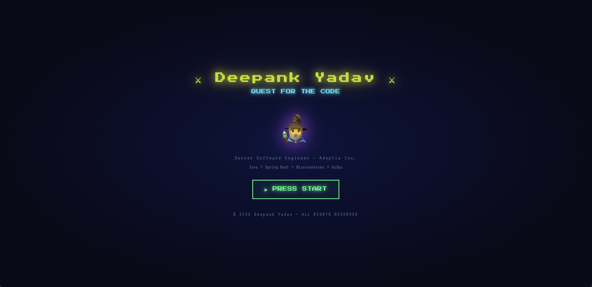

<div align="center">

# ⚔️ Quest for the Code

**An RPG-style developer portfolio built with zero frameworks**

[](https://deepankyadav.netlify.app)
[](https://github.com/deepank-yadav)
[](https://medium.com/@thecodebean)
[](#changelog)



</div>

---

## 🗺️ What Is This?

A fully interactive RPG-style portfolio where visitors explore 8 zones to learn about me — built with **vanilla HTML, CSS, and JavaScript**. No React, no Node, no build step. Just pure browser magic.

- 🎮 Navigate like a video game — world map, zone panels, XP system
- 📡 **Live data** — GitHub stats and Medium posts update automatically on every visit
- 🎵 **Ambient audio** — RPG background music + sound effects via Web Audio API
- 📱 **Fully responsive** — mobile, tablet, and desktop layouts
- 🔒 **Privacy-first** — no email exposed, no tracking, no cookies

---

## 🏰 The 8 Zones

| Zone | Icon | Description |
|------|------|-------------|
| **CHARACTER** | 👤 | Who is this hero? Bio & live GitHub stats |
| **SKILLS FORGE** | ⚡ | Mastered abilities — animated skill bars |
| **BATTLE LOG** | 💼 | Wars fought & won — work experience |
| **ARTIFACT HALL** | 🏗 | Epic creations forged — projects |
| **SCROLL LIBRARY** | ✍️ | Live Medium blog posts, auto-fetched newest first |
| **ACADEMY** | 🎓 | Knowledge scrolls — education |
| **TROPHY VAULT** | 🏆 | Legendary achievements & badges |
| **SIGNAL TOWER** | 📡 | Send a message — Formspree contact form |

---

## ✨ Features

### 🔴 Live Data
- **GitHub API** — repos, followers, stars, languages fetched on every visit (no API key required)
- **Medium RSS** — latest blog posts auto-rendered newest-first via 3-proxy fallback chain (AllOrigins → rss2json → corsproxy.io)

### 🎵 Audio Engine
- **♪ ANTHEM** — ambient RPG background music (Cm pad chords + pentatonic arpeggio at 72 BPM), fades in/out smoothly
- **✦ SPELL** — click sounds, zone enter chimes, XP gain pings, PRESS START fanfare
- Zero external audio files — all sounds generated in-browser via Web Audio API
- HUD toggle buttons styled in gold Press Start 2P pixel font

### 🎮 Interactivity
- Animated Canvas starfield (200 twinkling stars)
- XP system — earn XP for exploring each zone
- Pixel-art RPG aesthetic — Press Start 2P + VT323 + Orbitron fonts
- Bottom navigation bar for mobile

### 📱 Responsive Design
| Breakpoint | Layout |
|------------|--------|
| Desktop > 700px | 3-column zone grid, full HUD |
| Tablet 400–700px | 2-column zone grid, compact HUD |
| Mobile ≤ 400px | 2-column grid, icon-only nav buttons |

### 🔒 Privacy & Security
- Email address never exposed anywhere in source code
- Contact handled exclusively via Formspree proxy
- No analytics, no cookies, no third-party tracking

---

## 🗂️ File Structure

```
├── index.html              # App shell — HUD, world map, audio controls
├── styles.css              # All styling — RPG theme, grid, responsive
├── main.js                 # Logic — live data, audio engine, zone rendering
├── portfolio-config.js     # ← All your content lives here
└── images/
    ├── favicon.ico             # Multi-size favicon (16–256px)
    ├── favicon-192.png         # Android / Chrome
    ├── apple-touch-icon.png    # iOS home screen
    └── og-image.png            # 1200×630 social preview thumbnail
```

---

## 🚀 Deploy Your Own

### 1. Fork & Clone
```bash
git clone https://github.com/deepank-yadav/quest-for-the-code.git
cd quest-for-the-code
```

### 2. Edit `portfolio-config.js`
All your content lives in one file — name, bio, skills, experience, projects, education, achievements:
```js
const PORTFOLIO_CONFIG = {
  hero: {
    name:   "YOUR NAME",
    title:  "Your Title",
    github: "your-github-username",
    medium: "https://medium.com/@yourhandle",
  },
  // skills, experience, projects, education, achievements...
}
```

### 3. Set Up Contact Form
1. Go to [formspree.io](https://formspree.io) → sign up free
2. Create a new form → copy your endpoint
3. Replace the Formspree endpoint in `main.js`

### 4. Deploy (pick one)

**Netlify** *(recommended — drag & drop, done in 30 seconds)*
```
netlify.com/drop → drag your project folder
```

**GitHub Pages**
```
Settings → Pages → Source: main branch, root folder
```

**Vercel**
```bash
npx vercel --prod
```

---

## 📡 Live Data Sources

| Data | API | Frequency |
|------|-----|-----------|
| GitHub profile (followers, repos) | `api.github.com/users/{username}` | Every visit |
| GitHub repo list & stars | `api.github.com/users/{username}/repos?per_page=100` | Every visit |
| Medium blog posts | Medium RSS feed via proxy chain | Every visit |
| Contact messages | Formspree POST | On submit |

> **Note:** GitHub public API allows 60 requests/hour per IP (no auth needed). Medium RSS is limited to the latest 10 posts — this is a hard platform limit set by Medium.

---

## 🎨 Customisation

All colours are CSS variables — edit in `styles.css`:
```css
:root {
  --cyan:   #00E5FF;   /* borders, highlights  */
  --gold:   #FFD700;   /* zone names, HUD      */
  --green:  #00FF88;   /* skill bars, success  */
  --purple: #B44BFF;   /* accents              */
  --bg:     #080818;   /* page background      */
}
```

---

## 📋 Changelog

| Version | Date | Highlights |
|---------|------|------------|
| **v1.2.0** | Feb 2026 | Audio engine — ♪ ANTHEM BGM + ✦ SPELL SFX; Medium 3-proxy RSS; gold pixel HUD buttons |
| **v1.1.0** | Feb 2026 | World map 6-col grid fix; full mobile responsive overhaul; Open Graph + Twitter Card meta tags; wizard favicon; email privacy |
| **v1.0.0** | Jan 2026 | Initial release — 8 zones, live GitHub + Medium data, Formspree contact, starfield, XP system |

---

## 🔗 Links

| | |
|---|---|
| 🌐 Live Site | https://deepankyadav.netlify.app |
| 💻 GitHub | https://github.com/deepank-yadav |
| ✍️ Blog | https://medium.com/@thecodebean |
| 💼 LinkedIn | https://linkedin.com/in/deepankyadav |

---

<div align="center">

**Built by Deepank Yadav — no frameworks harmed in the making of this portfolio** ⚔️

</div>
